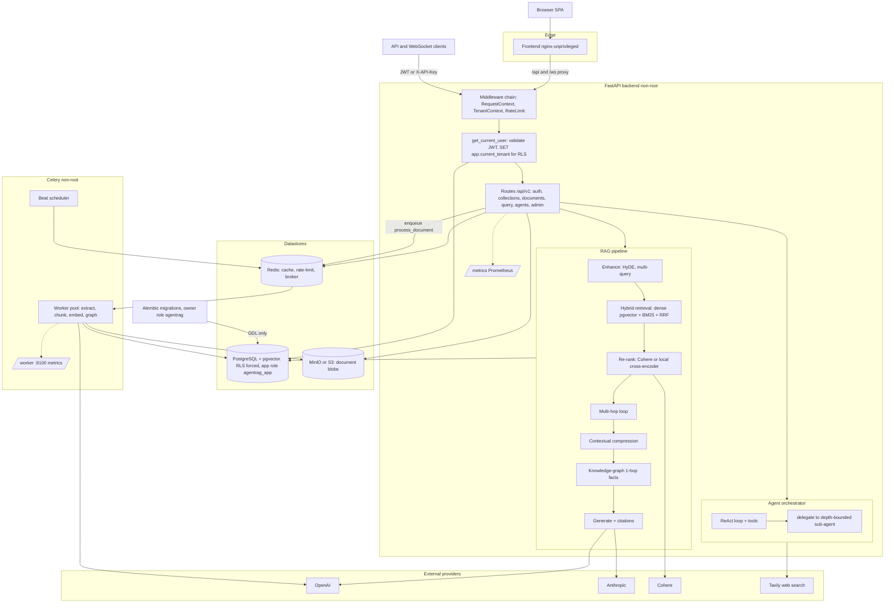

# Architecture

This reflects the **hardened** system (after Phases 0–3 and the frontend pass), not the
original demo. See [`PRODUCTION_ROADMAP.md`](PRODUCTION_ROADMAP.md) for how it got here.

## How to read it

**Edge → backend.** The browser SPA is served by a non-root nginx that reverse-proxies
`/api` and `/ws` to the backend. API/WS clients hit the backend directly with a JWT (or
`X-API-Key`).

**Request path (the security spine).** Every request passes the middleware chain —
`RequestContextMiddleware` binds an `X-Request-ID` for log correlation, `TenantContext`
decodes the JWT, `RateLimit` applies tier (and IP, for `/auth`) limits. The
`get_current_user` dependency is the *enforcement point*: it validates the JWT, loads the
user, and runs `SET app.current_tenant` so Postgres Row-Level Security scopes every query.

**Tenant isolation (the keystone).** The app and worker connect as **`agentrag_app`** — a
non-owner, non-superuser role — with `FORCE ROW LEVEL SECURITY` on every tenant table, so
RLS actually applies. Alembic connects as the owner role for DDL only.

**RAG pipeline.** Hybrid retrieval (dense pgvector + BM25, fused with RRF) → optional
re-rank (Cohere or a local cross-encoder) → optional multi-hop, contextual compression, and
knowledge-graph facts → generation with filtered citations. Every advanced step is opt-in
per request and degrades gracefully.

**Agents.** A ReAct orchestrator over a tool registry; agents can `delegate` to a
depth-bounded sub-agent.

**Async ingestion.** Uploads enqueue a Celery task via Redis; the worker pool extracts →
chunks → embeds → (optionally) extracts knowledge-graph triples, writing to Postgres and
MinIO. Workers run non-root with exponential-backoff retries and export their own metrics.

**Observability.** The backend exposes `/metrics`; the worker exposes its own metrics on
`:9100` (prometheus multiprocess mode). Logs carry request/tenant correlation.
