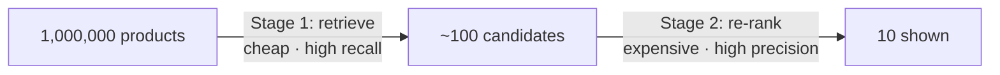
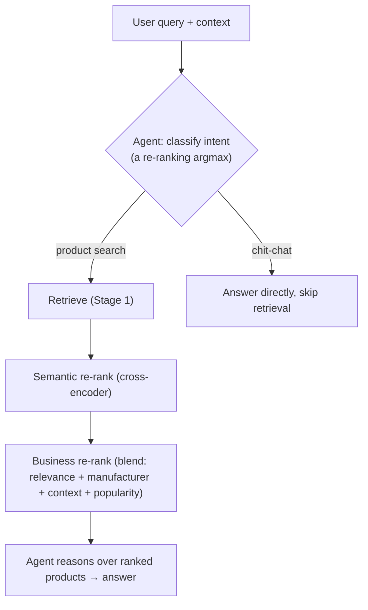

# Re-ranking & Ranking — Concepts + a Build Plan

A focused companion to the [Learning Guide](learn/README.md). It answers two questions:

1. **What is re-ranking, really?** — the concept, from first principles, with the exact
   mechanics used in this repo.
2. **How would I build a *product-catalog* ranker on top of agentic RAG?** — a staged plan you
   can follow from an empty folder, reusing the patterns already in `retriever.py`.

The running example throughout is a **product search**: a user types *"wireless headphones"*,
they're operating in some **context** (say, gaming), and the business wants to **favor certain
manufacturers**. That one example exposes the whole design space.

> Where the concept already lives in this codebase: [`backend/app/services/rag/retriever.py`](../backend/app/services/rag/retriever.py)
> (`_rrf_fusion` and `_rerank`). Read this doc with that file open.

---

## Part 1 — The concept

### 1.1 Why re-rank at all? The recall/precision funnel

No single search method is both **fast over millions of items** and **precise about ordering**.
So you split the job into two stages:

- **Stage 1 — Retrieve (recall).** Cheap, approximate, scans *everything*. Vector search + BM25.
  Its job is *don't miss the good items* — not to order them perfectly.
- **Stage 2 — Re-rank (precision).** Expensive, accurate, only affordable on a *shortlist*. Its
  job is to order that shortlist correctly.



This is exactly what [`HybridRetriever.retrieve()`](../backend/app/services/rag/retriever.py)
does: Stage 1 pulls `top_k * 3` candidates from dense + sparse search, Stage 2 re-ranks and cuts
to `top_k`.

> **One-line definition:** *Re-ranking is a precise second pass that reorders the shortlist a
> cheap first pass produced.*

### 1.2 Bi-encoder vs cross-encoder (the mechanism)

Two ways to score "how well does item X match query Q?":

| | **Bi-encoder** | **Cross-encoder** |
|---|---|---|
| How | Embed Q and X **separately**, compare vectors (cosine) | Feed **(Q, X) together** into one model, output a score |
| Sees interaction? | No — vectors computed in isolation | Yes — cross-attention between Q and X |
| Speed | Very fast (embed X **once**, offline) | Slow (must run the model per pair, at query time) |
| Accuracy | Good | Better |
| Used for | **Stage 1** retrieval | **Stage 2** re-ranking |

The whole reason re-ranking is a *separate stage* is this speed/accuracy split: you can't afford
a cross-encoder over a million items, but over 100 candidates it's cheap and much sharper.

In this repo the cross-encoder is [`_rerank_local`](../backend/app/services/rag/retriever.py):

```python
pairs  = [(query, c.content) for c in chunks]      # (Q, X) pairs
scores = await asyncio.to_thread(model.predict, pairs)   # one score per pair
ranked = sorted(zip(chunks, scores), key=lambda cs: cs[1], reverse=True)[:top_k]
```

That's the entire idea. Cohere's hosted reranker ([`_rerank_cohere`](../backend/app/services/rag/retriever.py))
is the same thing behind an API.

### 1.3 The fork in the road: two *kinds* of re-ranking

This is the key distinction, and the one most people conflate.

**Kind 1 — Relevance re-ranking (semantic).** *"How well does this item match the query text?"*
This is the cross-encoder. It only knows about text.

**Kind 2 — Contextual / business re-ranking.** *"Given items that are all relevant enough, what
order best serves this user, this context, this business?"* It reorders by signals that have
**nothing to do with text match**: user context, manufacturer preference, price, margin,
popularity, stock, recency.

> Our product example — *"favor certain manufacturers"* and *"user in a specific context"* — is
> **Kind 2**. A cross-encoder cannot help; it doesn't know Sony is your preferred vendor.
>
> - **Semantic re-ranking** answers *"is it relevant?"*
> - **Business re-ranking** answers *"of the relevant ones, which do we surface?"*

A real product ranker usually does **both**: cross-encoder for relevance, *then* blend in
business signals — or fold relevance in as one signal among many.

### 1.4 Blending signals (the score-fusion view)

Business re-ranking is a weighted blend. For our headphones search:

```
final = w_rel · relevance          # from Stage 1 fusion (or a cross-encoder)
      + w_mfr · manufacturer_match  # 1.0 if preferred maker, else 0
      + w_ctx · context_match       # user is "gaming" → boost gaming headsets
      + w_pop · popularity          # normalized sales/clicks
      − w_stk · out_of_stock_penalty
```

Sort by `final`. That's contextual re-ranking. It's the **same shape** as this repo's
[`_rrf_fusion`](../backend/app/services/rag/retriever.py), which already blends two signals with
`dense_weight` / `sparse_weight` — just with more signals and business meaning. Each weight is a
dial: `w_mfr` literally means *"how much do we care about manufacturer vs. pure relevance."*

> **Normalize before you blend.** Relevance (0–1), popularity (0–100k sales), price ($) live on
> wildly different scales. Add them raw and whichever has the biggest numbers dominates. Min-max
> or z-score each signal to a common range first. (RRF sidesteps this by fusing *ranks* instead
> of *scores* — a robust trick when scales are incomparable.)

### 1.5 The spectrum of "prefer manufacturer X" (weakest → strongest)

These are distinct tools with very different behavior. Know which one you're reaching for:

| Technique | What it does | When to use |
|---|---|---|
| **Hard filter** | Remove all non-X products | User *explicitly* said "only Sony" — this is filtering, **not** ranking |
| **Pinning** | Force X into the top N slots | Sponsored/promoted placement |
| **Multiplicative boost** | `score *= 1.3` for X | Gentle nudge; X wins ties, but a much better off-brand match can still outrank |
| **Additive signal** | `+ w_mfr · manufacturer_match` | Tunable, composes cleanly with other signals |
| **Learned weight** | A model *learns* how much manufacturer matters | You have click/purchase data (§1.6) |

Design instinct: **prefer a soft boost over a hard filter** unless the user was explicit. A hard
filter that hides a perfect off-brand match creates a bad experience; a boost lets relevance stay
in charge while preference breaks ties.

### 1.6 The mature version: Learning to Rank (LTR)

Hand-tuning `w_rel, w_mfr, w_ctx…` is a great *start* — but how do you know the right weights?

1. **Manual + A/B test** — set weights by intuition, ship, measure click-through / conversion,
   adjust. **Start here.**
2. **Learning to Rank** — once you log *which results users clicked/bought*, turn each
   `(query, product)` pair into a **feature vector** `[relevance, manufacturer_match, price,
   popularity, context_match, …]` and train a model (classically **LambdaMART** / gradient-boosted
   trees — e.g. XGBoost's `rank:` objective) to predict the ideal order. The model *learns* the
   weights, including nonlinear interactions ("manufacturer matters more for accessories than for
   laptops"). This is how real e-commerce search ranks.

**Maturity arc:** fixed-weight fusion → hand-tuned business boosts → learned ranker (LTR). Each
stage plugs into the *same* Stage-2 slot; only the scoring function inside gets smarter.

### 1.7 Where "agentic" fits

In an agentic system (this repo's [`AgentOrchestrator`](../backend/app/services/agents/orchestrator.py)),
the agent is the thing that **decides the ranking context** rather than hard-coding it:

- **Intent / routing** — classify the query first (*is this a product search, a comparison, or
  chit-chat?*). Note: intent classification is itself a re-ranking problem — you score the query
  against a small set of candidate intent labels and take the argmax. (Same cross-encoder, `argmax`
  instead of top-k.)
- **Signal selection** — the agent chooses *which* boosts apply: if the user says "for gaming,"
  it sets `context = gaming`; if they're a repeat Sony buyer, it raises `w_mfr`.
- **Tool use** — retrieval + re-ranking become a **tool** the agent calls, then it reasons over
  the ranked results (compare top 3, ask a follow-up, etc.).



---

## Part 2 — The build plan

Goal: a **product-catalog ranker** that does two-stage retrieval + semantic re-rank + business
re-rank, driven by an agent that sets the context. Reuse this repo's patterns; don't reinvent.

### What you're reusing from this codebase

| You need | Already here | File |
|---|---|---|
| Signal-blending template | `_rrf_fusion` (generalize 2 → N signals) | `retriever.py` |
| Stage-2 re-rank slot | `_rerank` / `_rerank_local` / `_rerank_cohere` | `retriever.py` |
| A candidate carrying ranking features | `RetrievedChunk` has a `metadata` dict already | `retriever.py` |
| Provider-config pattern | `cohere_api_key`, `default_reranker_model`, `local_reranker_model` | `core/config.py` |
| Agentic routing | ReAct loop + `ToolRegistry` | `services/agents/` |

### Stage 0 — Model the domain

- Define a `Product` (id, title, description, **manufacturer**, price, popularity, in_stock, tags).
- Embed each product's `title + description` **once at ingest** (bi-encoder, offline) and store the
  vector — mirror how `Chunk` stores an embedding.
- Business fields (manufacturer, price, popularity) are **not** embedded; they're ranking features
  read at query time.

### Stage 1 — Retrieve (recall)

- [ ] Dense search over product embeddings (pgvector cosine) — copy `_dense_search`.
- [ ] Sparse BM25 over `title + description` — copy `_sparse_search` (nails exact model names /
      SKUs that embeddings blur).
- [ ] Fuse with RRF — copy `_rrf_fusion`. Output: ~100 candidates each with a `relevance` score.

### Stage 2a — Semantic re-rank (relevance)

- [ ] Cross-encoder over `(query, product_title+desc)` pairs — copy `_rerank_local`.
- [ ] Keep it **best-effort with a fallback** to fused order (the pattern in `_rerank`, lines
      around the `try/except`). A flaky reranker must never break search.

### Stage 2b — Business re-rank (the new part)

- [ ] A `ProductReranker` that computes the blended `final` score from §1.4.
- [ ] Normalize each signal to a common scale **before** blending (§1.4 warning).
- [ ] Make weights **config-driven** (like `dense_weight`/`sparse_weight`), not hard-coded — you'll
      tune them constantly.
- [ ] Implement manufacturer preference as an **additive signal** first (softest useful option
      from §1.5). Add hard filter / pinning only where the product explicitly calls for it.

Sketch (the shape, not final code):

```python
def business_score(p, relevance, ctx):
    return (
        W.rel * relevance
        + W.mfr * (1.0 if p.manufacturer in ctx.preferred_makers else 0.0)
        + W.ctx * context_match(p, ctx)          # e.g. "gaming" tag overlap
        + W.pop * normalize(p.popularity)
        - W.stk * (0.0 if p.in_stock else 1.0)
    )
```

### Stage 3 — Make it agentic

- [ ] **Intent router** in front (§1.7): product-search vs comparison vs chit-chat. Skip retrieval
      for chit-chat. (Build it as the cross-encoder-argmax classifier — reuses your Stage-2a model.)
- [ ] Expose "search + rank products" as a **tool** in the `ToolRegistry` so the agent calls it,
      then reasons over the ranked list.
- [ ] Let the agent **set the context** (`preferred_makers`, `gaming`, budget) from the
      conversation, and pass it into `business_score`.

### Stage 4 — Measure & mature (don't skip)

- [ ] Log every query + shown results + **clicks/purchases**. This log is the fuel for everything.
- [ ] A/B test weight changes; watch click-through / conversion, not vibes.
- [ ] When you have enough labeled data, replace the hand-tuned blend with **LTR** (§1.6) — the
      `business_score` function becomes a trained model call; everything around it stays.

### Guardrails (learned from the RAG side of this repo)

- **Degrade gracefully.** Every optional step (semantic rerank, LLM router) must fall back, not
  fail — mirror the `degraded`-list pattern in `RAGPipeline`.
- **Cache the cross-encoder per process.** Loading torch is expensive — see `_get_local_reranker`.
- **Keep heavy sync work off the event loop.** `CrossEncoder.predict` runs under
  `asyncio.to_thread` in `_rerank_local`; do the same.
- **Normalize signals** before blending; **prefer soft boosts** over hard filters.

---

## TL;DR

Re-ranking is a **precise second pass over a cheap first pass's shortlist**. There are two kinds:
**semantic** ("is it relevant?", a cross-encoder) and **business/contextual** ("of the relevant
ones, which do we surface?", a weighted blend of signals). Your product scenario — favor a
manufacturer, respect user context — is the **business** kind: blend relevance with normalized,
weighted signals, prefer soft boosts over hard filters, and mature from fixed weights → hand-tuned
boosts → **learning-to-rank** as click data accumulates. An **agent** sits on top to classify
intent and choose which signals apply. The bones already exist in `retriever.py`
(`_rrf_fusion` = the blend, `_rerank` = the Stage-2 slot).

---

See also: [Learning Guide · RAG pipeline](learn/07-rag-pipeline.md) ·
[Learning Guide · Agents](learn/08-agents.md) · [`retriever.py`](../backend/app/services/rag/retriever.py)
