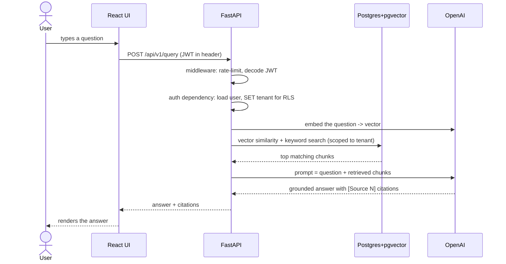

# 00 · Orientation

## What problem does this solve?

Imagine a company with thousands of internal documents. Employees want to *ask questions* and
get answers grounded in those documents, with citations — not generic answers from a chatbot.

That's **RAG (Retrieval-Augmented Generation)**:

1. **Retrieve** the most relevant chunks of text from the company's documents.
2. **Augment** a prompt to a large language model (LLM) with those chunks.
3. **Generate** an answer that's grounded in (and cites) that retrieved text.

AgentRAG does this **as a service** for many organizations at once (multi-tenant), with an
agent layer on top that can reason in multiple steps and use tools.

## The tech stack, and why each piece exists

| Layer | Tech | Job | Closest .NET equivalent |
|------|------|-----|--------------------------|
| Web API | **FastAPI** (Python) | HTTP + WebSocket endpoints | ASP.NET Core Web API (Minimal APIs) |
| ASGI server | **Uvicorn** | Runs the Python web app, handles sockets | Kestrel |
| Validation | **Pydantic** | Request/response models, settings | DataAnnotations + `IOptions<T>` + records |
| ORM | **SQLAlchemy** (async) | Map Python objects ↔ DB rows | Entity Framework Core |
| Migrations | **Alembic** | Versioned schema changes | EF Core Migrations |
| Database | **PostgreSQL** + **pgvector** | Relational data **and** vector search | SQL Server (no built-in vectors) |
| Background jobs | **Celery** | Run slow tasks off the request | Hangfire / `BackgroundService` / Azure Functions |
| Queue / cache | **Redis** | Message broker + cache + rate-limit counters | Azure Service Bus + `IDistributedCache` |
| Blob storage | **MinIO** (S3 API) | Store raw uploaded files | Azure Blob Storage |
| LLM providers | **OpenAI / Anthropic / Cohere** | Embeddings, generation, re-ranking | (external APIs) |
| Frontend | **React + Vite + TypeScript** | Single-page UI | Blazor / Angular |
| Packaging | **pip + requirements.txt** | Dependencies | NuGet + `.csproj` |
| Containers | **Docker + docker-compose** | Run everything reproducibly | Docker + `docker-compose` (same) |
| CI | **GitHub Actions** | Lint + test on push | GitHub Actions / Azure DevOps |

### Why Python (vs .NET) for this?

Not because Python is "better" — because the **AI/ML ecosystem lives in Python**. The client
libraries for OpenAI/Anthropic/Cohere, tokenizers (`tiktoken`), embedding models
(`sentence-transformers`), and vector tooling are all first-class in Python. You *could* build
this in .NET (Semantic Kernel exists), but you'd be swimming upstream for the ML bits. For a
learning project, using the mainstream AI stack means every tutorial and example applies.

## The shape of a single request

When a user asks a question, here's the whole journey (don't worry about the details yet —
each gets its own page):



## The two "runtimes" you'll see

This is important and trips up newcomers. The backend code runs in **two different processes**:

1. **The web process** (`uvicorn app.main:app`) — handles HTTP/WebSocket requests. Fast,
   request/response.
2. **The worker process** (`celery ... worker`) — handles slow background jobs (reading a PDF,
   computing embeddings). It has *no* HTTP server; it pulls jobs from Redis.

They share the **same codebase** but start different entry points. In .NET terms: imagine one
solution where `dotnet run` starts a Web API, and a second deployment of the same DLLs starts a
Hangfire worker. Same code, two roles. (See `backend/Dockerfile` — one image, two `command`s in
`docker-compose.yml`.)

## Repository map

```
backend/
  app/
    main.py            # web app entry point (the FastAPI "app" object)
    core/              # cross-cutting: config, db, security, redis, logging, metrics, celery
    api/
      v1/              # the HTTP route handlers (controllers), one file per area
      deps/            # dependency-injection helpers (auth, access checks)
    middleware/        # request middleware (tenant context, rate limit, request-id)
    models/            # SQLAlchemy ORM classes (database tables)
    schemas/           # Pydantic request/response models (DTOs)
    services/
      rag/             # the RAG pipeline: chunker, embedder, retriever, generator, ...
      agents/          # the ReAct agent orchestrator + tools
      processing/      # the Celery tasks + file extractors
  migrations/          # Alembic schema versions
  tests/               # pytest tests
frontend/
  src/                 # React app (components, services/api.ts, store, types)
deploy/helm/           # Kubernetes Helm chart
docs/                  # you are here
```

A good rule while learning: **`api/v1` is "controllers", `services/` is "business logic",
`models/` is "entities", `schemas/` is "DTOs".** That mental split maps cleanly onto .NET.

---

Next: [Python & async primer →](02-python-async-primer.md)
