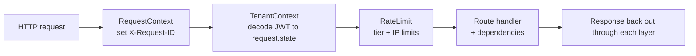
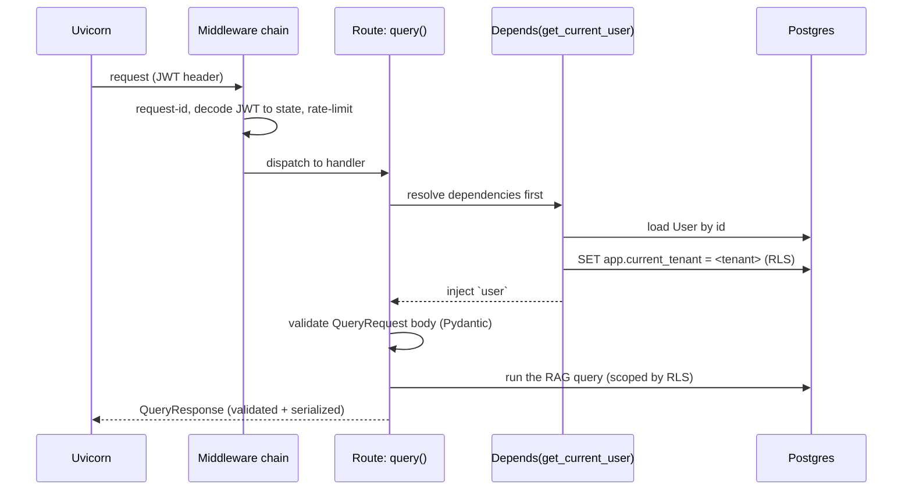

# 02 · The request lifecycle

This page traces exactly what happens from "an HTTP request arrives" to "a handler runs." If
you know ASP.NET Core's pipeline (middleware → routing → filters → action + DI), this will feel
familiar with different names.

## The players

- **Uvicorn** = the web server (Kestrel). It speaks HTTP and **ASGI**.
- **ASGI** = the async equivalent of .NET's `HttpContext`/middleware contract. It's a calling
  convention: `async def app(scope, receive, send)`. Every middleware is a function that wraps
  the next one. You normally don't write raw ASGI — FastAPI does it for you — but our
  request-ID middleware is raw ASGI (see why below).
- **FastAPI** = the web framework (ASP.NET Core). It gives you routing, model binding,
  validation, dependency injection, and OpenAPI docs.
- **Starlette** = the lower-level toolkit FastAPI is built on (think the `Microsoft.AspNetCore`
  primitives under Minimal APIs). `BaseHTTPMiddleware` comes from here.

The app object is created in `backend/app/main.py`:

```python
app = FastAPI(title="AgentRAG", lifespan=lifespan)
app.add_middleware(RateLimitMiddleware)
app.add_middleware(TenantContextMiddleware)
app.add_middleware(RequestContextMiddleware)
app.include_router(api_router)        # mounts all /api/v1 routes
```

`lifespan` is startup/shutdown hooks (like `IHostedService.StartAsync/StopAsync`).

## The middleware chain (order matters, and it's reversed)

`app.add_middleware(X)` **prepends** X to the stack, so the **last one added runs first
(outermost)**. Our order means a request flows:



- **`RequestContextMiddleware`** (`middleware/request_context.py`) — generates/propagates an
  `X-Request-ID` and binds it to the logging context so every log line for this request is
  correlated. It's **raw ASGI**, not `BaseHTTPMiddleware`, on purpose: `BaseHTTPMiddleware`
  runs the inner app in a *different task*, and Python `contextvars` (our correlation store)
  don't reliably flow across that boundary. (This is a real gotcha — see the file's docstring.)
- **`TenantContextMiddleware`** (`middleware/tenant_context.py`) — decodes the JWT (if present)
  and stamps `request.state.tenant_id` / `tenant_tier` / `user_id`. **It does not
  authenticate** — it just reads the token onto the request so the rate limiter can see the
  tier. The real auth check happens in a dependency (below).
- **`RateLimitMiddleware`** (`middleware/rate_limiter.py`) — uses Redis to enforce per-tenant
  (by tier) limits, plus a stricter per-IP limit on `/auth/*` (so login can't be brute-forced).

`request.state` is a per-request bag, like `HttpContext.Items`.

## Routing & "controllers"

Routes are grouped with `APIRouter` (≈ a controller). Each area is a file in `api/v1/`:

```python
# api/v1/query.py
router = APIRouter()

@router.post("", response_model=QueryResponse)   # POST /api/v1/query
async def query(req: QueryRequest, user: User = Depends(get_current_user), db = Depends(get_db)):
    ...
```

They're aggregated in `api/v1/router.py` and mounted under `/api/v1` in `main.py`. The
`@router.post("")` is the routing attribute (`[HttpPost]`). `response_model=QueryResponse`
declares the output DTO (used for serialization **and** the OpenAPI schema).

## Dependency injection — `Depends(...)`

This is FastAPI's killer feature and the part most worth understanding. A parameter like
`user: User = Depends(get_current_user)` says: *"before running this handler, call
`get_current_user`, and inject its return value as `user`."*

```python
# api/deps/auth.py
async def get_current_user(
    credentials = Depends(security),        # dependencies can depend on dependencies
    db: AsyncSession = Depends(get_db),
) -> User:
    payload = decode_token(credentials.credentials)   # validate JWT signature/expiry
    user = (await db.execute(select(User).where(User.id == payload["sub"]))).scalar_one_or_none()
    if not user: raise HTTPException(401, "Not authenticated")
    await set_tenant_context(db, str(user.tenant_id))  # <-- the security keystone (next page)
    return user
```

Differences from ASP.NET Core DI:
- It's **per-parameter and explicit** (you opt a handler in), not a global service container
  resolved by constructor.
- Dependencies can be **async**, can themselves take dependencies, and run **per request**.
- `get_db` is a dependency that **yields** a database session and closes it after the request
  — like a scoped `DbContext` tied to the request, with cleanup guaranteed:

```python
async def get_db():
    async with AsyncSessionLocal() as session:
        try:
            yield session          # hand the session to the handler
        finally:
            await session.close()  # always cleaned up
```

`yield` here makes it a "dependency with teardown" (the code after `yield` runs on the way out).

A few specialized auth dependencies build on `get_current_user`:
- `require_admin` — 403 unless `user.role == "admin"`.
- `require_member` — 403 for viewers.
Putting `Depends(require_admin)` on a route is how you do role-based authorization.

## Model binding & validation — Pydantic

`req: QueryRequest` automatically parses + validates the JSON body into a typed object. The
DTOs live in `schemas/`:

```python
# schemas/query.py
class QueryRequest(BaseModel):
    query: str = Field(min_length=1, max_length=10000)
    collection_ids: Optional[List[UUID]] = None
    top_k: int = Field(default=5, ge=1, le=50)
    use_graph: bool = False
    # ... all the optional retrieval toggles
```

- `BaseModel` ≈ a DTO with DataAnnotations baked in. `Field(ge=1, le=50)` is `[Range(1,50)]`.
- If the body is invalid, FastAPI returns a **422** with a precise error — you never write that
  code. This is how a dynamically-typed language gets compile-time-ish safety **at the edge**.
- The matching response model (`QueryResponse`) controls what's serialized back and documents
  the API. Extra fields you don't declare are dropped — a safety net.

## Putting it together: a `POST /api/v1/query`



The thing to internalize: **the handler body only runs after middleware passed and all
`Depends` resolved.** Auth, the DB session, and the tenant security context are all set up by
dependencies *before* your business logic sees the request. That's the same separation of
concerns ASP.NET gives you with middleware + filters + DI, just expressed differently.

---

Prev: [Python & async primer](02-python-async-primer.md) · Next: [Multi-tenancy & RLS →](04-multitenancy-and-rls.md)
