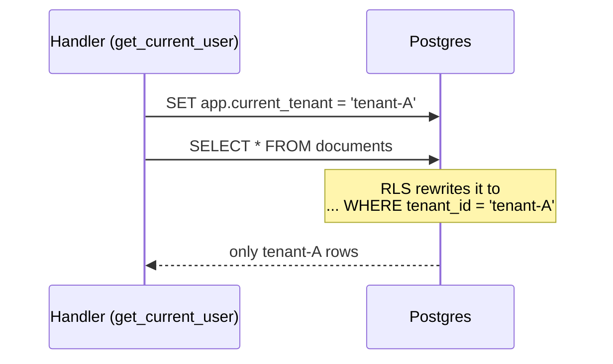
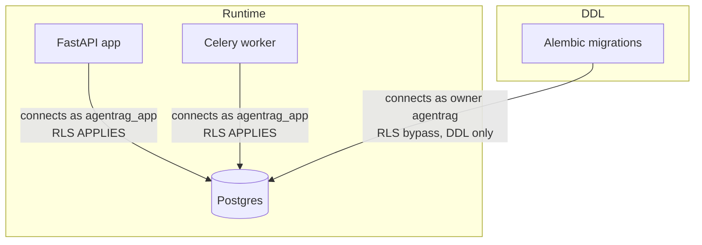

# 03 · Multi-tenancy & Row-Level Security (the keystone)

This is the most important design idea in the whole system. Get this and the rest makes sense.

## What "multi-tenant" means

One running application serves **many customer organizations (tenants)**, and tenant A must
**never** see tenant B's data. Three common ways to isolate tenants:

| Strategy | Isolation | Cost |
|----------|-----------|------|
| Database per tenant | Strongest | Expensive, hard to manage at scale |
| Schema per tenant | Strong | Many schemas to migrate |
| **Shared tables with a `tenant_id` column** | Depends entirely on *every query* filtering by `tenant_id` | Cheapest, but one missed `WHERE` = a data leak |

AgentRAG uses the **shared-table** model — every table has a `tenant_id` — and then adds a
database-enforced safety net so a forgotten filter can't leak data. That safety net is
**Row-Level Security (RLS)**.

## The problem with "just filter by tenant_id"

If isolation depends on developers remembering `WHERE tenant_id = @me` on every query, you're
one bug away from a breach. (.NET devs: EF Core global query filters help, but they can be
bypassed with `IgnoreQueryFilters()` or raw SQL.) We want the **database itself** to refuse to
return another tenant's rows, no matter what the app code does.

## How RLS works in Postgres

PostgreSQL can attach a **policy** to a table that automatically adds a condition to *every*
query. Our policy (created in the migrations) is, for each tenant table:

```sql
CREATE POLICY tenant_isolation_documents ON documents
USING (tenant_id::text = current_setting('app.current_tenant', true));
```

Read it as: *"a row is only visible if its `tenant_id` equals the session variable
`app.current_tenant`."*

- `current_setting('app.current_tenant', true)` reads a **per-connection session variable**
  (a "GUC"). The `true` means "return NULL if it's not set" (instead of erroring).
- If the variable isn't set, the comparison is `tenant_id = NULL` → `NULL` → **the row is
  hidden**. So it **fails closed** (deny by default). Good.

So the app must, at the start of each request, tell the database "I am tenant X" by setting
that variable. That happens in the `get_current_user` dependency:

```python
# core/database.py
async def set_tenant_context(session, tenant_id):
    await session.execute(
        sa_text("SELECT set_config('app.current_tenant', :tenant_id, false)"),
        {"tenant_id": str(uuid.UUID(str(tenant_id)))},   # validated as a real UUID first
    )
```

> Note the value is passed as a **bound parameter**, never string-concatenated into SQL — that
> avoids SQL injection (.NET: always use parameters, never interpolate; same rule here).



## The keystone gotcha — and the fix

Here's the subtle, critical part that was the headline bug in this codebase's history:

> **Postgres exempts a table's owner (and any superuser) from RLS** unless you *also* tell it to
> FORCE the policy. And even FORCE doesn't constrain a superuser.

The app originally connected to Postgres as the `agentrag` role, which **owned the tables and
is a superuser**. So RLS policies existed but were **completely ignored** — isolation was
silently resting on app-level `WHERE` clauses only. The policies were decoration.

The fix (two parts, see migration `004_app_role_force_rls.py`):

1. **A dedicated, non-owner, non-superuser role** — `agentrag_app` — that the **app and worker
   connect as at runtime**. Because it doesn't own the tables and isn't a superuser, RLS
   policies actually apply to it.
2. **`ALTER TABLE ... FORCE ROW LEVEL SECURITY`** on every tenant table — defense in depth.

Migrations still run as the owner `agentrag` (DDL needs ownership). So:



This is wired purely through **two connection strings** in `docker-compose.yml`:
- `DATABASE_URL` (the app/worker, async) → `agentrag_app`
- `DATABASE_SYNC_URL` (Alembic) → `agentrag`

**The lesson worth tattooing on your brain:** *a multi-tenant guarantee is only as real as the
database role the app connects as.* RLS policies are inert until the connecting role is a
non-owner, non-superuser role subject to them.

## Defense in depth — two layers

The app uses **both** layers, on purpose:

1. **App-level checks** (the "gate") — e.g. `assert_collections_accessible` in
   `api/deps/access.py` returns a clear `403`/`404` when you ask for a collection you can't
   access. This gives good error messages and works even if RLS were misconfigured.
2. **RLS** (the "net") — even if a developer forgets a filter, the database returns nothing for
   the wrong tenant.

Belt *and* suspenders. Never rely on one layer for a security-critical invariant.

## Where tenant_id comes from

It's a **claim inside the JWT** the user presents. When they log in, the token is signed with
`tenant_id`, `sub` (user id), `tier`, and `role`. The middleware reads it; the `get_current_user`
dependency re-validates it and sets the RLS context. So the chain is:

`login → signed JWT(tenant_id) → each request carries it → dependency sets DB session variable →
RLS scopes every query`.

## One subtlety to remember (connection pooling)

The tenant variable is set **per database connection/session**. With connection pooling, you
must set it at the start of *every* request that touches tenant data — which is exactly what the
`get_current_user` dependency guarantees, because (almost) every tenant-data route depends on
it. The few paths that don't (like `login`, which writes an audit log before auth resolves) set
the context explicitly. If you ever add a route that touches tenant tables without
`get_current_user`, RLS will return **zero rows** (fail-closed) — a loud, safe failure.

---

Prev: [Request lifecycle](03-request-lifecycle.md) · Next: [Auth →](05-auth.md)
