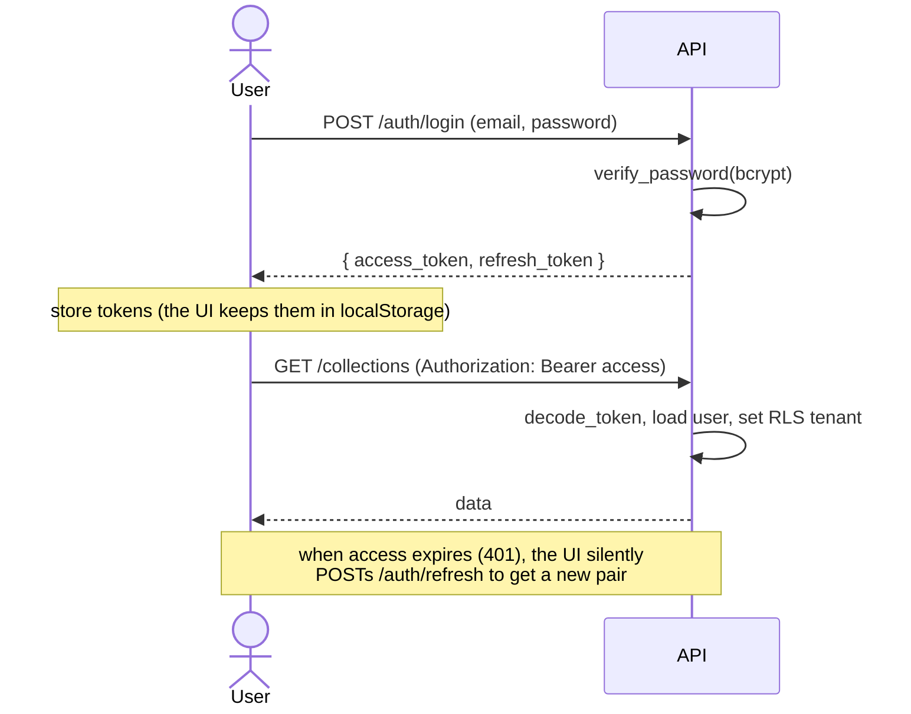
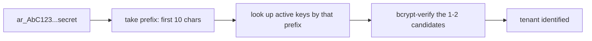

# 04 · Authentication & authorization

"Authentication" = *who are you*. "Authorization" = *what may you do*. This page covers both,
plus how the pieces are stored. Code lives in `core/security.py`, `api/v1/auth.py`, and
`api/deps/auth.py`.

## Passwords — hashing, never storing

You never store a raw password. You store a **bcrypt hash**. Bcrypt is a deliberately slow,
salted hash designed for passwords (so brute-forcing is expensive).

```python
# core/security.py
pwd_context = CryptContext(schemes=["bcrypt"])
def hash_password(p): return pwd_context.hash(p)            # at registration
def verify_password(plain, hashed): return pwd_context.verify(plain, hashed)  # at login
```

.NET analogy: ASP.NET Identity's `PasswordHasher<T>` does the same thing. The stored value is a
self-describing string containing the algorithm, cost, salt, and hash.

## JWTs — stateless login tokens

After a successful login the server returns two **JSON Web Tokens (JWTs)**:

- An **access token** — short-lived (30 min). Sent on every request as
  `Authorization: Bearer <token>`. Carries claims: `sub` (user id), `tenant_id`, `tier`, `role`,
  `exp` (expiry), `type: "access"`.
- A **refresh token** — long-lived (7 days). Used only to get a new access token when it expires.

A JWT is `base64(header).base64(payload).signature`. The **signature** is an HMAC of the first
two parts using the server's `JWT_SECRET`. Anyone can *read* a JWT (it's not encrypted, just
encoded), but they can't *forge* one without the secret. So:

> **Never put secrets in a JWT, and protect `JWT_SECRET` like a crown jewel.** If it leaks,
> anyone can mint tokens for any tenant. (That's why `core/config.py` refuses to boot in
> production with the default secret — see the ops page.)

```python
# core/security.py
def create_access_token(data):
    to_encode = {**data, "exp": now + 30min, "type": "access"}
    return jwt.encode(to_encode, settings.jwt_secret, algorithm="HS256")

def decode_token(token):
    try: return jwt.decode(token, settings.jwt_secret, algorithms=["HS256"])  # verifies sig+exp
    except JWTError: return None
```

.NET analogy: this is exactly `Microsoft.AspNetCore.Authentication.JwtBearer` + `System.IdentityModel.Tokens.Jwt`,
just hand-rolled with the `python-jose` library. The `type` claim lets us reject a refresh token
where an access token is required, and vice-versa.

### The login → token → request loop



The UI's API client (`frontend/src/services/api.ts`) automatically attaches the token and, on a
`401`, calls `/auth/refresh` once and retries — so the user isn't logged out every 30 minutes.

## API keys — for programmatic access

Humans use JWTs; scripts/services use **API keys** (`auth/api-keys`). A key looks like
`ar_<random>`. We store only its **bcrypt hash** plus a short **prefix** (the first 10 chars).

When a key is presented, we look it up by **prefix** (indexed), then bcrypt-verify only the
one or two candidates — instead of hashing the presented key against *every* key in the system
(which would be O(n) bcrypt calls per request — slow and a DoS vector). See
`get_user_from_api_key` in `api/deps/auth.py`.



(The .NET equivalent: store a hash + a lookup-friendly prefix; never scan-and-hash everything.)

## Authorization — roles (RBAC)

Three roles: `admin`, `member`, `viewer`. Authorization is enforced with the dependency helpers
from the request-lifecycle page:

```python
@router.post("/api-keys")
async def create_api_key(user = Depends(require_admin), ...): ...   # admins only

@router.post("/collections")
async def create_collection(user = Depends(require_member), ...): ... # members + admins
```

`require_admin`/`require_member` simply check `user.role` and raise `403` otherwise. Because
they're built on `get_current_user`, applying one also guarantees the RLS tenant context is set.

## Rate-limiting auth (brute-force defense)

Login/registration are limited **per IP** (not per tenant — there's no tenant yet pre-login) in
`middleware/rate_limiter.py`. Without this, an attacker could guess passwords unlimited times.
The limiter uses Redis to count requests per IP per minute and returns `429 Too Many Requests`
past the threshold. It only trusts the `X-Forwarded-For` header when explicitly configured to
(behind a proxy you control), because clients can spoof that header.

## Putting the security model together

```
password (bcrypt) ─▶ login ─▶ signed JWT (tenant_id, role, exp)
                                   │
        each request carries it ───┤
                                   ▼
        middleware decodes ─▶ get_current_user re-validates ─▶ sets RLS tenant
                                   │                                │
                          require_admin/member (RBAC)        DB enforces isolation
```

Auth (who you are) + RBAC (what you may do) at the app layer, **and** RLS at the data layer.

---

Prev: [Multi-tenancy & RLS](04-multitenancy-and-rls.md) · Next: [Data, the ORM & vectors →](06-data-and-vectors.md)
