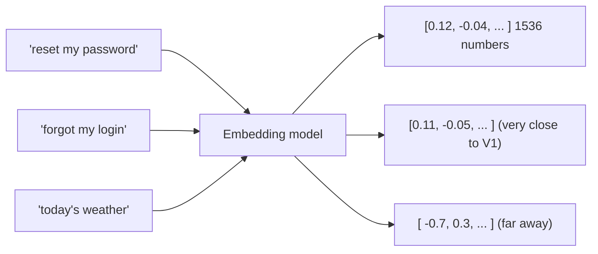
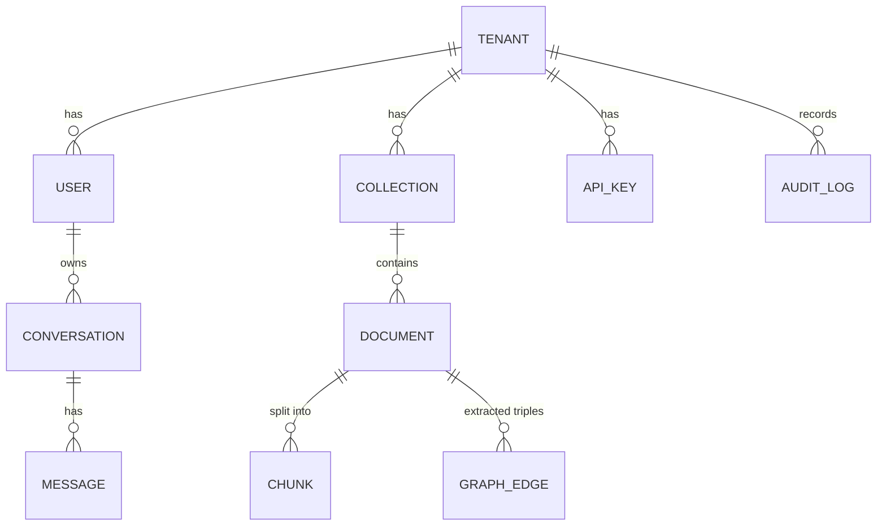

# 05 · Data, the ORM & vectors

This page covers how data is stored and queried, and the one genuinely new concept for most
backend devs: **vector embeddings**.

## PostgreSQL + the ORM

The database is **PostgreSQL**. The app talks to it through **SQLAlchemy**, an ORM very much
like Entity Framework Core.

### Models = entities

`models/` holds the table definitions. Each class is a table:

```python
# models/chunk.py
class Chunk(Base):
    __tablename__ = "chunks"
    id = Column(UUID(as_uuid=True), primary_key=True, default=uuid.uuid4)
    tenant_id = Column(UUID(as_uuid=True), nullable=False, index=True)
    document_id = Column(UUID, ForeignKey("documents.id", ondelete="CASCADE"))
    content = Column(Text, nullable=False)
    embedding = Column(Vector(1536), nullable=True)     # <-- the vector column (pgvector)
    chunk_index = Column(Integer, nullable=False)
```

EF Core analogy: `Base` ≈ `DbContext`'s entity base, `Column(...)` ≈ EF property + fluent
config, `ForeignKey(... ondelete="CASCADE")` ≈ a relationship with cascade delete. `index=True`
≈ `[Index]`.

### Querying — the async SQLAlchemy 2.0 style

```python
result = await db.execute(
    select(Document).where(Document.id == doc_id, Document.tenant_id == user.tenant_id)
)
doc = result.scalar_one_or_none()        # FirstOrDefault()
```

- `select(Document).where(...)` builds a query (like LINQ `context.Documents.Where(...)`).
- `await db.execute(...)` runs it; `.scalar_one_or_none()` / `.scalars().all()` shape the
  results (`FirstOrDefault()` / `ToList()`).
- It's **async** end to end via the `asyncpg` driver — non-blocking DB I/O, which is why the
  whole API can be async.
- `db` is the request-scoped session injected by `Depends(get_db)` — like a scoped `DbContext`.

`db.add(obj)` then `await db.commit()` inserts/updates (like `Add` + `SaveChangesAsync`).

### Two connection URLs (recap from the RLS page)

`core/database.py` builds an **async** engine from `DATABASE_URL` (used by the app, connecting
as the restricted `agentrag_app` role). Alembic uses a separate **sync** URL
(`DATABASE_SYNC_URL`, the owner role) for migrations. Same database, two roles, two drivers.

## Migrations — Alembic

Schema changes are versioned files in `migrations/versions/`, applied with
`alembic upgrade head`. This is **EF Core Migrations** with different commands:

| EF Core | Alembic |
|---------|---------|
| `Add-Migration X` | `alembic revision --autogenerate -m "X"` |
| `Update-Database` | `alembic upgrade head` |
| `Remove-Migration` | `alembic downgrade -1` |

Each file has `upgrade()` and `downgrade()` functions and a `down_revision` linking it to the
previous one (a singly-linked chain). The backend container runs `alembic upgrade head` on
startup, so the schema is always current. The migrations also create the **RLS policies** and,
in `004`, the restricted role — schema *and* security live in version control together.

## Embeddings — searching by *meaning*

Here's the new idea. Keyword search finds documents containing the *words* you typed. But "How
do I reset my password?" and "I forgot my login credentials" share almost no words yet mean the
same thing. To match on **meaning**, we use **embeddings**.

An **embedding** is a function (run by an LLM provider) that turns a piece of text into a list
of numbers — a **vector** — e.g. 1536 numbers for OpenAI's `text-embedding-3-small`. The magic
property: **texts with similar meaning produce vectors that are close together** in that
1536-dimensional space.



"Close together" is measured by **cosine similarity** (the angle between vectors). So to find
relevant chunks for a question:

1. Embed the question → a query vector.
2. Find the stored chunk vectors **nearest** to it.

### pgvector — vectors *inside* Postgres

Plain Postgres can't store or compare vectors. The **`pgvector`** extension adds:
- A `vector` column type (`embedding = Column(Vector(1536))`).
- Distance operators — `<=>` is cosine distance.
- An **HNSW index** for fast approximate nearest-neighbor search (so you don't scan every row).

The retriever's dense search is essentially:

```sql
SELECT id, content, 1 - (embedding <=> :query_vector) AS score
FROM chunks
WHERE tenant_id = :tenant AND embedding IS NOT NULL
ORDER BY embedding <=> :query_vector      -- nearest first (uses the HNSW index)
LIMIT :k;
```

(.NET note: there's no first-class SQL Server equivalent today — vector search there is newer
and less mature. This "vectors live next to my relational data, scoped by the same RLS" property
is a big reason Postgres + pgvector is popular for RAG.)

### Why store chunks, not whole documents?

LLMs have a limited context window, and similarity is sharper on focused passages. So documents
are split into **chunks** (a few hundred tokens each) at ingestion time, and *each chunk* gets
its own embedding. A query then retrieves the most relevant *chunks*, not whole files. How that
splitting works is the start of the next page.

## The data model at a glance



Every one of these tables carries `tenant_id` and is protected by RLS. A **collection** is a
named bucket of documents (like a folder / knowledge base); a **chunk** is a searchable piece of
a document; **graph_edge** holds knowledge-graph triples (covered in the RAG page);
**conversation/message** store chat history; **audit_log** records admin actions.

---

Prev: [Auth](05-auth.md) · Next: [The RAG pipeline →](07-rag-pipeline.md)
