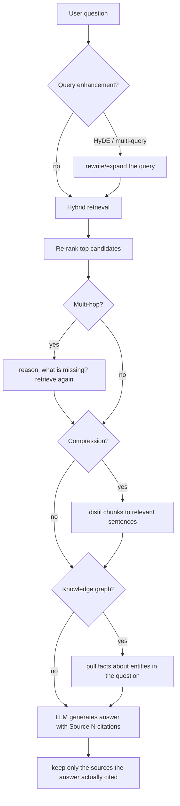
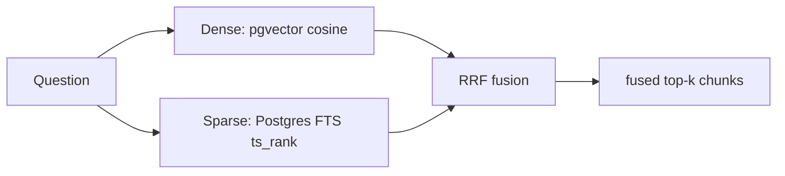

# 06 · The RAG pipeline

This is the heart of the product. There are two halves:

- **Ingestion (write path)** — when a document is uploaded: read → chunk → embed → store.
  Runs in the background worker (next page covers *how* it runs; here we cover *what* it does).
- **Query (read path)** — when a question is asked: enhance → retrieve → re-rank → (multi-hop)
  → (compress) → (graph) → generate. Runs in the request.

Code: `backend/app/services/rag/` (pipeline, chunker, embedder, retriever, generator,
query_enhancer, compressor, multihop, graph, evaluator) and `services/processing/` (the worker
task + extractors).

## Ingestion: turning a file into searchable chunks


### 1. Extract — `services/processing/extractors.py`

Different file types need different readers: `pypdf` for PDFs, `python-docx` for Word,
BeautifulSoup for HTML, Tesseract/vision for images, Whisper for audio, and an HTTP crawler for
URLs (single page, recursive, or sitemap). Each extractor returns plain text. The dispatcher
picks the right one by the document's type.

### 2. Chunk — `services/rag/chunker.py`

Splitting matters more than it sounds. Strategies (chosen per collection):
- **fixed** — every N tokens with an overlap (so a sentence split across a boundary still
  appears whole in one chunk).
- **semantic / paragraph** — split on natural boundaries (paragraphs, headings).
- **recursive** — try big separators first, fall back to smaller.
- **parent-child** — small chunks for precise matching, each linked to a larger "parent" chunk
  for context.

A **token** is roughly ¾ of a word; the `tiktoken` library counts them the way the model does.
> A real bug we fixed lives here: if `chunk_overlap >= chunk_size`, the fixed-window step
> becomes ≤ 0 and the loop never advances — an *infinite loop* that hangs the worker. The fix
> clamps overlap below size. Lesson: bounds-check anything that drives a loop.

### 3. Embed — `services/rag/embedder.py`

Each chunk's text is sent to the embedding model (OpenAI by default) which returns its 1536-dim
vector (see the previous page). Texts are batched and truncated to the model's token limit.

### 4. Store

Each chunk becomes a row in `chunks` with its `content`, `embedding`, `tenant_id`, etc. Now the
document is searchable.

## Query: from a question to a grounded answer

The orchestrator is `RAGPipeline.query()` in `services/rag/pipeline.py`. Every step after basic
retrieval is **opt-in per request** (flags like `use_hyde`, `use_multi_hop`, `use_graph`) and
**degrades gracefully** — if an optional LLM call fails, it logs, records the failure in a
`degraded` list on the response, and continues. Here's the full flow:



Let's unpack each box.

### Query enhancement — `query_enhancer.py`

The user's wording may not match the documents' wording. Two tricks:
- **Multi-query:** ask an LLM for 2-3 reworded versions of the question, retrieve for each, and
  merge — casting a wider net.
- **HyDE (Hypothetical Document Embeddings):** ask the LLM to *write a fake answer* to the
  question, then embed *that* and search with it. Counter-intuitive, but a hypothetical answer
  often sits closer (in vector space) to the real answer passages than the question does.

### Hybrid retrieval — `retriever.py` (the core)

Pure vector search is great at meaning but can miss exact terms (names, error codes, IDs). Pure
keyword search nails exact terms but misses paraphrases. So we do **both** and fuse them:

1. **Dense search** — pgvector cosine nearest-neighbors (meaning).
2. **Sparse search — Postgres full-text search** — keyword relevance (the same idea as BM25, the
   algorithm search engines used before embeddings). Ranked with `ts_rank` over a GIN-indexed
   `content_tsv` column *in the database* (migration 006). An earlier version scored BM25 in Python
   over ≤1000 loaded rows — moving it in-DB removed that scaling limit (see the [competitive
   roadmap](../COMPETITIVE_ROADMAP.md) item ⑤).
3. **Reciprocal Rank Fusion (RRF)** — combine the two ranked lists. Each item gets a score of
   `Σ weight / (k + rank)` across the lists; items ranked highly by *either* method bubble up.
   It's a simple, robust way to merge rankings without tuning score scales.



### Re-ranking — `retriever._rerank`

The fused top candidates are then **re-ranked** by a **cross-encoder** — a model that looks at
the (question, chunk) *pair together* and scores true relevance (more accurate, but too
expensive to run on every chunk, hence only on the top candidates). Uses Cohere's reranker if
configured, else a local `sentence-transformers` model, else it's a no-op. Best-effort: any
failure falls back to the fused order.

### Multi-hop — `multihop.py`

Some questions need facts from *different* chunks ("Who manages the author of the 2019 report?"
— one chunk has the author, another has their manager). Multi-hop does **retrieve → reason →
retrieve**: after the first pass, an LLM decides whether the context is sufficient or proposes
*one* follow-up query for the missing piece; we retrieve that and accumulate. Bounded by
`max_hops`. It's adaptive — if the first pass already answers, it does zero extra hops.

### Contextual compression — `compressor.py`

A retrieved chunk often contains one relevant sentence buried in irrelevant text, which wastes
the LLM's context window and dilutes the signal. A cheap model **distils each chunk down to only
the sentences relevant to the question** (and drops chunks that are entirely irrelevant).
Fail-safe: a chunk that errors is kept whole rather than lost.

### Knowledge graph — `graph.py`

Optionally (per collection), during ingestion an LLM extracts **(subject, predicate, object)
triples** — e.g. *(Maria Chen, reports to, Tom Blake)* — into the `graph_edges` table. At query
time, `use_graph` finds the entities named in the question, expands **one hop** to their
neighbors, and feeds those explicit facts to the generator. This lets the model answer from
*relationships* that no single text chunk states outright.

### Generation & citations — `generator.py`

Finally, the retrieved (and possibly compressed/graph-augmented) context is assembled into a
prompt:

```
System: Answer from the context. Cite sources as [Source N].
Context:
[Source 1] ...chunk text...
[Source 2] ...chunk text...
[Knowledge Graph Facts] Maria Chen reports to Tom Blake
Question: <user question>
```

The LLM (OpenAI or Anthropic — chosen by the model name) writes the answer. Then a clever final
step: we parse the answer for `[Source N]` markers and **return only the citations the answer
actually used** (`_extract_cited_sources`). So the "Sources" list reflects what truly grounded
the answer, not just everything retrieved.

### Provider routing (no abstraction layer)

There's no `ILlmProvider` interface — the code simply branches on the model name string:
`model.startswith("claude")` → Anthropic SDK, else OpenAI SDK. Every external call goes through
a small client factory (`core/llm_clients.py`) that sets a timeout and bounded retries, so a
slow/flaky provider fails fast instead of hanging a request.

### Optional self-evaluation — `evaluator.py`

With `evaluate=true`, after generating, a separate LLM scores the answer for *faithfulness*
(is it grounded in the context?), *relevance*, and *precision* — useful for measuring quality.

### Newer layers — routing, business re-ranking, memory, tracing

Four more opt-in capabilities wrap the flow above (each has a deep-dive page):

- **Intent routing** (`use_routing`, `intent.py`) — classify the query first and *skip retrieval*
  for chit-chat, so "hello" doesn't hit the retriever. It's a zero-shot classifier: embed the query
  and each intent's anchor text, take the nearest (argmax). See the
  [glossary §6](13-rag-glossary.md#6-query-understanding).
- **Business / metadata re-ranking** (`boosts`, `ranking.py`) — after semantic re-ranking, blend
  relevance with weighted *business* signals from chunk metadata (manufacturer, popularity, …):
  `final = base·norm(relevance) + Σ boosts`. This is the "of the relevant ones, which do we
  surface?" layer — the whole of [`../RERANKING.md`](../RERANKING.md).
- **Conversation-memory bounding** (`conversation_memory.py`) — before generation, a long chat
  history is trimmed to a recent, token-budgeted window plus a running summary of older turns, so it
  can't blow the context window.
- **Per-query tracing** (`trace=true`, `tracing.py`) — every query records stage latencies, the
  retrieved chunks + scores, tokens, and estimated cost; a structured summary is logged. This is how
  you debug "why did it answer that?". See [the query trace](14-query-trace.md) and
  [evaluation](15-evaluation.md).

## Why so many optional steps?

This is the "production-grade RAG" part: a basic pipeline is *retrieve top-k → stuff into prompt
→ generate*. Each optional step (hybrid, rerank, HyDE, multi-hop, compression, graph) targets a
specific failure mode of that basic version. They're opt-in because each costs latency/tokens,
and they degrade gracefully so one flaky model call can't break a query.

---

Prev: [Data & vectors](06-data-and-vectors.md) · Next: [The agent system →](08-agents.md)
