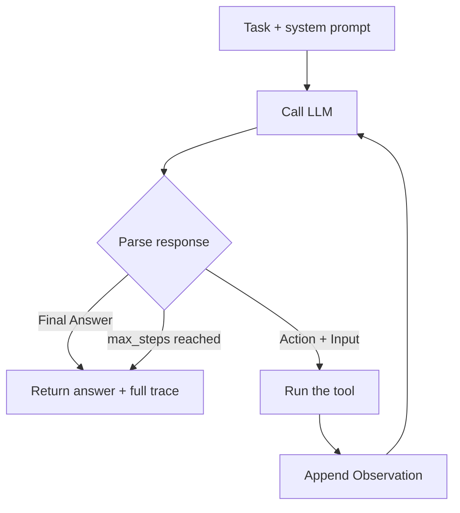
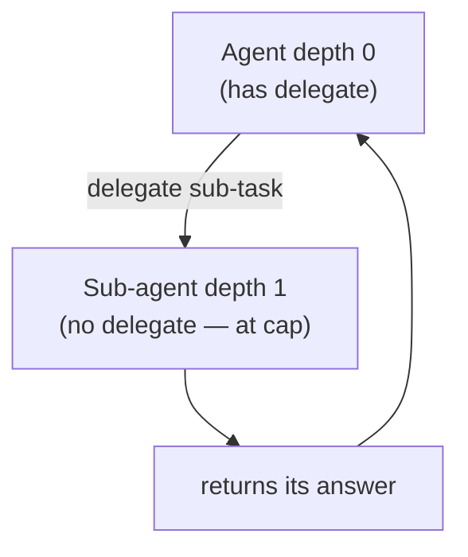

# 07 · The agent system

RAG answers a single question with one retrieval + one generation. An **agent** can *reason over
multiple steps* and *use tools* to accomplish a more open-ended task ("Research X and compare it
to Y"). Code: `backend/app/services/agents/`.

## The ReAct loop

The agent uses the **ReAct** pattern (Reason + Act). The LLM is prompted to think in a loop of:

```
Thought:  (what should I do next?)
Action:   <tool name>
Action Input: {"param": "value"}
Observation: (the tool's result, fed back in)
... repeat ...
Thought: I now have enough information.
Final Answer: ...
```

The orchestrator (`orchestrator.py`) runs this loop: it calls the LLM, **parses the text** for
`Action`/`Action Input`, runs the named tool, appends the `Observation`, and calls the LLM
again — until the model emits `Final Answer` or it hits `max_steps`.



> Note: this is "manual" ReAct — the model emits text we parse, rather than using the
> provider's native function-calling API. It's simpler to follow and provider-agnostic, at the
> cost of being more fragile to formatting. A production v2 would likely switch to native tool
> calling. Worth understanding both.

The four agent "types" (`research`, `analyst`, `summarizer`, `code`) are **just different system
prompts** over the same loop and tools — not different engines.

## Tools — `tools.py`

A **tool** is a capability the agent can invoke. The `ToolRegistry` is the single source of
truth: each tool has a name, a description (shown to the LLM so it knows when to use it), and a
handler. The real tools:

| Tool | What it does |
|------|--------------|
| `retrieval` | Run the RAG retriever over the tenant's documents |
| `calculator` | Safely evaluate a math expression |
| `web_search` | Tavily web search (only offered when an API key is configured) |
| `summarize` | LLM-summarize a long text |
| `compare` | LLM-compare two texts |
| `delegate` | Hand a sub-task to a fresh sub-agent (see below) |

The registry is also what the `/agents/types` endpoint reports, so the API can never advertise a
tool that isn't actually implemented (a past inconsistency that's now structurally impossible).

## Multi-agent delegation

The `delegate` tool lets an agent spawn a **sub-agent** for a focused sub-task (e.g. a research
agent delegates "summarize these findings" to a summarizer). The sub-agent is a fresh
`AgentOrchestrator` run.

The danger is infinite recursion (agent delegates to agent delegates to agent...). The guard is
a **depth counter**: the top agent is depth 0; the `delegate` tool is only offered while
`depth < MAX_DELEGATION_DEPTH`, and a sub-agent runs at `depth + 1`. Past the cap, the tool
disappears from the agent's toolset and the handler refuses. So delegation is bounded.



There's a subtle implementation detail worth seeing: the `tools` module needs to create an
`AgentOrchestrator`, but `orchestrator` imports `tools` — a circular import. It's resolved with a
**lazy import** inside the `delegate` handler (importing at call time, not module load). That's a
common Python pattern for breaking import cycles.

## Streaming

Both the RAG query and the agent loop have streaming variants. The pipeline yields events
(`token`, `citations`, `done`) which are pushed to the client over **Server-Sent Events (SSE)**
or **WebSocket** so the UI can render the answer as it's produced, token by token. (How the UI
consumes that is on the frontend page.)

## When to use RAG vs an agent

- **RAG query** (`/query`) — "answer this question from my docs." One shot, fast, cheap.
- **Agent** (`/agents/execute`) — "accomplish this task," possibly needing multiple retrievals,
  calculations, comparisons, or delegation. Slower, more tokens, more capable.

Agents are powerful but non-deterministic and costly — use them when the task genuinely needs
multi-step reasoning, not for simple lookups.

---

Prev: [The RAG pipeline](07-rag-pipeline.md) · Next: [Async ingestion →](09-async-ingestion.md)
