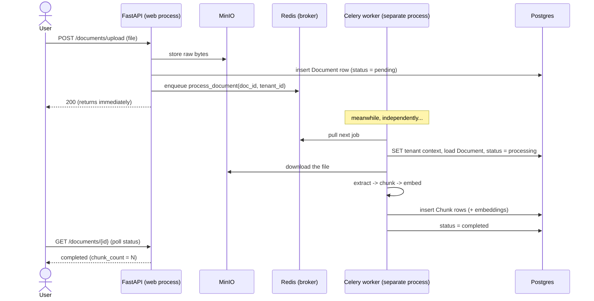

# 08 · Async ingestion (background work)

Reading a 200-page PDF, splitting it, and computing embeddings for hundreds of chunks takes
*seconds to minutes*. You can't do that inside an HTTP request — the user would stare at a
spinner and the request would time out. So that work runs in the **background**, on a separate
process, and the upload request returns immediately.

In .NET you'd reach for Hangfire, a `BackgroundService`, or Azure Functions + a queue. Here it's
**Celery + Redis**.

## The cast

- **Redis** — an in-memory data store used here as a **message broker**: a durable queue the API
  writes jobs into and workers read jobs out of. (Redis is also used as the rate-limit counter
  store and a cache — one tool, several jobs.)
- **Celery** — a Python distributed task queue. You define **tasks** (functions), the API
  *enqueues* a task, and a pool of **worker** processes execute them. (Hangfire is the closest
  .NET analogy.)
- **Celery beat** — a scheduler for periodic tasks (like cron / `IHostedService` timers). Present
  but lightly used here.

## The flow



The UI **polls** `GET /documents/{id}` to watch `status` go `pending → processing → completed`
(or `failed`).

## The task — `services/processing/tasks.py`

```python
@celery_app.task(bind=True, max_retries=3)
def process_document(self, document_id: str, tenant_id: str):
    run_async(_process_document_async(self, document_id, tenant_id))
```

A few things to notice, each with a lesson:

### 1. The web process *enqueues*; the worker *runs*

`process_document.delay(doc_id, tenant_id)` (called in the upload handler) doesn't run the
function — it serializes the arguments and pushes a message to Redis. A worker process picks it
up later. The two processes never call each other directly; Redis is the seam.

### 2. Sync Celery + async code: the `run_async` bridge

Celery tasks are **synchronous** functions, but our code (DB, LLM calls) is **async**. The
`run_async` helper runs the coroutine on an event loop.

> Bug we fixed here: the original code created a **fresh event loop per task and closed it**.
> But async HTTP clients (the OpenAI SDK) keep pooled connections tied to the loop they were
> created on; closing the loop out from under them raised *"Event loop is closed"* and could
> wedge the worker so later tasks hung. The fix: **reuse one event loop per worker process**.
> Lesson: async resources have lifetimes tied to their loop — don't yank the loop away.

### 3. Tenant context must be set in the worker too (RLS)

The worker connects as the restricted `agentrag_app` role (same as the app), so RLS applies to
it. Before it can read the document or insert chunks, it must `SET app.current_tenant` — which is
exactly why the task takes `tenant_id` as an argument. Without it, the worker would see **zero
rows** (fail-closed). The RLS keystone reaches into the background jobs too.

### 4. Retries with backoff

If a task throws (e.g. the embedding API blips), Celery retries up to 3 times. The retry delay is
**exponential with jitter** (`_retry_countdown`) — `~10s, ~20s, ~40s` with randomness — so many
simultaneous failures don't all retry in lockstep and hammer the recovering dependency. The
document is marked `failed` if it ultimately can't be processed.

### 5. Each task opens its own DB session/engine

The request session (from `get_db`) belongs to the web process. The worker creates its **own**
engine + session per task and disposes it in a `finally` (so a failed attempt doesn't leak
connections). Different process, different lifetime — don't share the request's session.

## Why a separate process at all?

Two reasons:
1. **Don't block the web event loop** — heavy CPU work (chunking, tokenizing) on the async loop
   would freeze *all* in-flight requests.
2. **Independent scaling** — you can run 1 web replica and 5 worker replicas (or vice-versa)
   depending on whether you're request-bound or ingestion-bound. The Helm chart exposes
   `backend.replicas` and `worker.replicas` separately for exactly this.

## The worker exposes its own metrics

Because the worker is a separate process group (and a *prefork* one — the main process forks
child workers), its Prometheus metrics can't be served by the web app's `/metrics`. It runs its
own tiny metrics HTTP server on `:9100` using prometheus's **multiprocess mode** (children write
samples to a shared dir; the main process aggregates and serves them). This is a fiddly but
standard pattern worth knowing if you ever instrument forking workers.

---

Prev: [The agent system](08-agents.md) · Next: [The frontend →](10-frontend.md)
