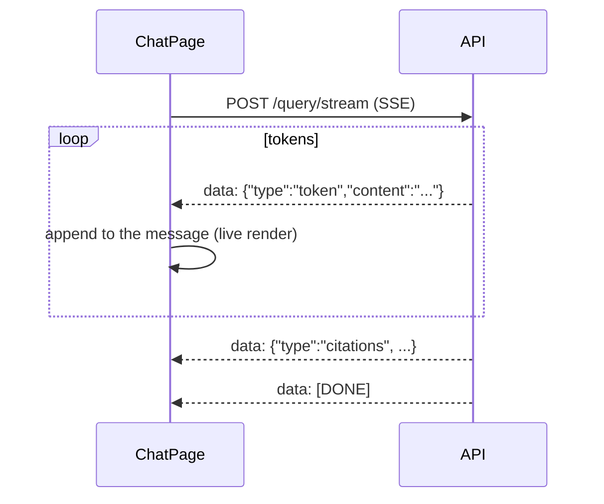

# 09 · The frontend

The UI is a **single-page application (SPA)**: the browser downloads a JavaScript bundle once and
then talks to the API with `fetch`/XHR, updating the page in place (no full reloads). If you've
used **Blazor WebAssembly** or **Angular**, this is the same idea with different tools. Code:
`frontend/src/`.

## The toolchain

| Tool | Job | .NET-ish analogy |
|------|-----|------------------|
| **TypeScript** | JavaScript + static types | C# (typed) vs JS (untyped) |
| **React** | Component UI library | Blazor components / Razor |
| **Vite** | Dev server + bundler | the `dotnet watch` + build, but for JS |
| **Zustand** | Tiny global state store | a singleton state service |
| **TanStack Query** | Server-data fetching/caching | a smart caching `HttpClient` wrapper |
| **Tailwind CSS** | Utility CSS classes | (no direct analogy; inline-ish styling) |
| **axios** | HTTP client | `HttpClient` |
| **npm** | Package manager | NuGet |

## React in one paragraph

A **component** is a function that returns markup (JSX — HTML-in-JS). It has **state** (via
`useState`) and **effects** (via `useEffect`, for side effects like fetching). When state
changes, React re-runs the function and efficiently updates the DOM. That's it.

```tsx
function Counter() {
  const [count, setCount] = useState(0);          // state, like a bound field
  return <button onClick={() => setCount(count + 1)}>Clicked {count}</button>;
}
```

Blazor analogy: `useState` ≈ a component field + `StateHasChanged()`; `useEffect` ≈
`OnInitializedAsync`/`OnParametersSet`. JSX ≈ Razor markup.

## The API client — `services/api.ts`

One axios instance with two **interceptors** (cross-cutting request/response hooks, like
`DelegatingHandler` in .NET):

1. **Request interceptor** — attaches `Authorization: Bearer <token>` from `localStorage`.
2. **Response interceptor** — on a `401`, calls `/auth/refresh` once, stores the new tokens, and
   retries the original request. This is what keeps the user logged in across access-token expiry.

The rest of the file is typed wrappers per area (`authApi`, `collectionsApi`, `queryApi`,
`chatApi`, `agentsApi`, `adminApi`) — thin, like a generated API client. The TypeScript types in
`types/index.ts` mirror the backend's Pydantic response models, so the front and back agree on
shapes (and `tsc` catches drift at build time).

## State: two kinds, two tools

A common source of confusion: there are **two** flavors of state, handled differently.

- **Client state** (auth tokens, theme) — owned by the app. Lives in **Zustand** stores
  (`store/authStore.ts`, `store/themeStore.ts`). A Zustand store is basically a global object
  with setters that re-render subscribed components.
- **Server state** (collections, documents, conversations) — owned by the API; the client just
  caches it. Handled by **TanStack Query** (`useQuery`), which fetches, caches, dedupes, and
  refetches automatically:

```tsx
const { data: collections } = useQuery({
  queryKey: ['collections'],
  queryFn: () => collectionsApi.list(),
});
```

The mental rule: **never store server data in `useState`/Zustand** — let TanStack Query own it,
so caching/refetching/invalidation are automatic. (.NET devs: think of it as a reactive
`IMemoryCache` keyed by `queryKey`, with `invalidateQueries(['collections'])` busting the cache
after a mutation.)

## Streaming the chat answer

The chat doesn't wait for the whole answer — it streams tokens as they're generated, so text
appears live. The backend offers two transports:

- **Server-Sent Events (SSE)** — a one-way stream of `data: {...}` lines over a normal HTTP
  response. The chat reads it with `fetch` + a `ReadableStream` reader, parsing `token` and
  `citations` events (see `ChatPage.tsx`, `streamQuery`). Simple and what the UI uses by default.
- **WebSocket** (`/query/ws/chat`) — a full duplex connection; also available for clients that
  prefer it.



### Conversation memory in the UI

The chat keeps a `conversation_id` (created on the first message) and sends it with every query,
so the backend loads prior turns as history and persists each new turn. That's why the assistant
"remembers" earlier messages. A row of toggles exposes the advanced retrieval options
(rerank/HyDE/multi-query/compression/multi-hop/graph/evaluate); when an advanced one is on, the
UI switches from streaming to the full `/query` endpoint and renders the richer response
(graph facts, hops, evaluation scores, degraded-feature badges).

## How it's served

`npm run build` compiles the TypeScript (`tsc`) and bundles everything (`vite build`) into static
files (`dist/`). In production those are served by a tiny **nginx** container that also
reverse-proxies `/api` and `/ws` to the backend (so the browser only talks to one origin). See
`frontend/Dockerfile` and `frontend/nginx.conf`.

---

Prev: [Async ingestion](09-async-ingestion.md) · Next: [Ops, Docker & deploy →](11-ops-and-deploy.md)
