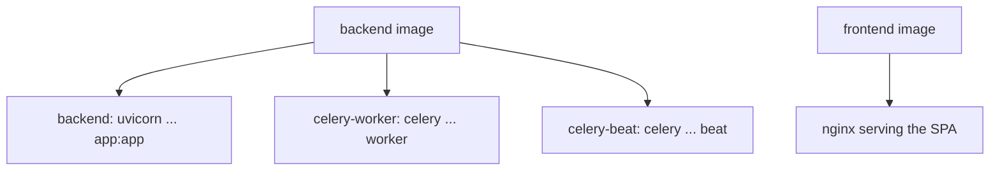

# 10 · Ops, Docker & deploy

How the whole thing runs, gets configured, and ships. Most of this maps cleanly to .NET ops;
the container parts are identical (Docker is Docker).

## Configuration — `.env` + Pydantic settings

All config comes from **environment variables**, loaded and validated by a Pydantic
`BaseSettings` class (`core/config.py`). This is the equivalent of `appsettings.json` +
`IOptions<T>`, but env-first (the 12-factor style):

```python
class Settings(BaseSettings):
    jwt_secret: str = "change-me-..."
    database_url: str = "postgresql+asyncpg://..."
    external_api_timeout_seconds: float = 30.0
    class Config:
        env_file = ".env"
```

Each field reads from an env var of the same name (uppercased). `.env` (git-ignored) holds the
local values. A nice production touch: a validator **refuses to boot** when `APP_ENV != development`
and the JWT secret / MinIO creds are still defaults — so you can't accidentally run prod with
demo secrets. Fail fast and loud beats silently insecure.

## Containers — one image, several roles

The backend has **one** Docker image (`backend/Dockerfile`). Different services run it with
different commands (in `docker-compose.yml`):



`docker-compose.yml` wires up **7 services**: postgres, redis, minio, backend, celery-worker,
celery-beat, frontend — plus the network and volumes between them. `docker-compose up -d` starts
the whole stack locally. This is the dev environment.

Production hardening (a separate `docker-compose.prod.yml`, and the Dockerfiles):
- **Non-root containers** — the backend runs as a dedicated `appuser`, the frontend as
  `nginx`-unprivileged. (A container process running as root that gets compromised is far more
  dangerous.)
- **No `--reload`** — dev uses uvicorn auto-reload; prod runs fixed workers.
- **Healthchecks, restart policies, resource limits**, datastores kept off the host network.
- **`.dockerignore`** so the image doesn't bloat with the local `venv`/`node_modules`.

## Observability — you can't operate what you can't see

Three pillars, all present:

1. **Metrics (Prometheus).** The backend exposes `/metrics` with custom counters/histograms
   (`rag_queries_total`, retrieval/generation latency). The worker exposes its own on `:9100`
   (separate process — see the ingestion page). Prometheus would scrape these; Grafana would
   chart them.
2. **Logs (structured + correlated).** Every request gets an `X-Request-ID` and, once
   authenticated, the tenant/user are bound to the logging context, so every log line for a
   request is tagged `[req=... tenant=...]`. That turns "find what happened to this request" from
   archaeology into a grep. (.NET analogy: `ILogger` scopes + a correlation-id middleware.)
3. **Health checks.** `/api/v1/health` for liveness/readiness probes.

The guiding principle the codebase follows: **fail loud in dev, degrade gracefully in
prod — but never silently.** Every caught exception is logged with context; "swallowed" errors
were treated as bugs.

## CI — GitHub Actions

`.github/workflows/ci.yml` runs on every push/PR, with three jobs:
- **Lint** — `ruff` (a fast Python linter/formatter; think StyleCop + analyzers).
- **Frontend** — `npm install` + `npm run build` (TypeScript typecheck + bundle).
- **Tests** — spins up real Postgres + Redis service containers, runs the **migrations** (which
  creates the `agentrag_app` role + RLS), then `pytest`. So CI exercises the real DB and the
  RLS isolation tests in a clean environment, not just mocked unit tests.

Tests use **pytest** (the standard Python test framework — like xUnit). Many are pure unit tests
with fakes/mocks; a few are integration tests that talk to the live DB and `skip` themselves when
no DB is reachable.

## Deploy targets

- **Docker Compose (prod)** — `docker-compose -f docker-compose.prod.yml up -d`. Good for a
  single VM.
- **Kubernetes (Helm)** — `deploy/helm/agentrag` is a minimal chart: Deployments for backend /
  worker / beat / frontend, a Services pair, an env **Secret**, and a **pre-upgrade migration
  Job** (so migrations run once per release, not once per replica — a classic footgun). Postgres
  / Redis / MinIO are expected to be managed services wired via `values.yaml`. It passes
  `helm lint` and renders cleanly.

## The "why it looks like this" meta-point

A lot of the non-obvious code (the non-owner DB role, the per-process event loop, the capped
upload reader, the fail-fast secret check, the prefork metrics exporter) exists because of bugs
or risks found by **running the system and watching it**, not by reading code. The single most
valuable habit this project teaches: **verify against the live stack.** Unit tests are necessary
but they passed while the real system was broken (inert RLS, the chunker infinite loop, the
event-loop wedge). If you take one operational lesson away, take that one.

---

Prev: [The frontend](10-frontend.md) · Next: [Build it yourself →](12-build-it-yourself.md)
