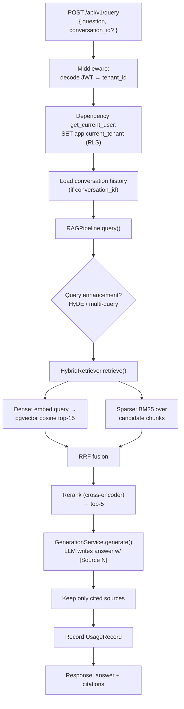

# 13 · A query, traced end-to-end

One real question, followed through every layer of the system, naming the technology at each hop.
This is the page that turns the [glossary](13-rag-glossary.md) from words into a mental movie — the
thing you replay in your head when a customer asks "so how does it actually work?"

We'll trace the exact query used to smoke-test the [evaluation harness](15-evaluation.md):

> **"Who led the Apollo internal project?"** → *"The Apollo internal project was led by engineer
> Maria Chen [Source 1]."*



Let's walk it.

## 0. The request

A `POST /api/v1/query` arrives with `{"question": "Who led the Apollo internal project?"}` and a
`Bearer` token (or `X-API-Key`). → route in `app/api/v1/query.py`.

## 1. Middleware stamps the tenant

`TenantContextMiddleware` decodes the JWT and stamps `request.state.tenant_id` / `tenant_tier` /
`user_id`. `RateLimitMiddleware` reads the tier and applies a Redis sliding-window limit. **Important:
middleware sets state but does *not* authenticate** — it's a hint, not a gate.

**Vocabulary:** *JWT, tenant, tier, rate limit.*

## 2. The dependency sets RLS context (the real gate)

The `get_current_user` dependency re-validates the token, loads the `User`, and calls
`set_tenant_context`, which runs `SELECT set_config('app.current_tenant', '<uuid>', false)`. From
here on, **every SQL query is automatically scoped to this tenant by Postgres Row-Level Security** —
the app literally cannot read another tenant's `chunks`. This is why any data route *must* depend on
`get_current_user`: without it, RLS context is never set.

**Vocabulary:** *RLS, tenant isolation, trust boundary.* *This is the box a security-minded customer
will poke hardest — be able to explain it cold.*

## 3. Conversation history (memory)

If the request carries a `conversation_id`, `_load_conversation_history` authorizes it (tenant + user)
and loads prior turns chronologically. Before generation, `ConversationMemory` (`conversation_memory.py`)
**bounds** that history: it keeps the most recent messages verbatim within a token budget and distils
older turns into a running summary — so a long chat can't blow the context window (roadmap item ②).

**Vocabulary:** *conversation memory, context window.*

## 4. Into the pipeline — optional query enhancement

`RAGPipeline.query()` orchestrates the rest. Every advanced step is **opt-in per request** and
**degrades gracefully** (a failed optional LLM call is logged into a `degraded` list, not fatal).

For our simple question, enhancement is off. Had we set `use_hyde=true`, the query would first be
rewritten into a hypothetical answer passage (see [HyDE](13-rag-glossary.md#6-query-understanding))
and *that* embedded instead.

**Vocabulary:** *query enhancement, HyDE, multi-query, graceful degradation.*

## 5. Hybrid retrieval — the core

`HybridRetriever.retrieve()` runs two searches in parallel and fuses them:

**5a. Dense search.** The query is embedded (`EmbeddingService.embed_query` → OpenAI
`text-embedding-3-small` → a 1536-dim vector), then pgvector finds the nearest chunk vectors by
**cosine distance**:
```sql
SELECT ..., 1 - (c.embedding <=> :query_vec::vector) AS score
FROM chunks c
WHERE c.tenant_id = :tenant_id AND c.embedding IS NOT NULL
ORDER BY c.embedding <=> :query_vec::vector
LIMIT 15                     -- top_k * 3 candidates
```
This finds chunks about *"Maria Chen led Apollo"* even if the query said "who ran the project."

**5b. Sparse search (BM25).** In parallel, up to 1000 candidate chunks for the tenant are loaded and
scored by **BM25** (keyword relevance) in-process — this is what would catch an exact token like a
project code. (Loading 1000 rows into Python is the known scaling limit — roadmap item ⑤.)

**5c. RRF fusion.** The two ranked lists are merged with **Reciprocal Rank Fusion**: each chunk gets
`Σ weight/(k + rank)`, so anything ranked highly by *either* search rises. No score-scale juggling.

**Vocabulary:** *dense/semantic search, embedding, cosine, pgvector, sparse/BM25, hybrid, RRF, top-k.*

## 6. Reranking

The fused shortlist goes to `_rerank`. With a **cross-encoder** configured (Cohere or a local
sentence-transformers model), it scores each `(query, chunk)` **pair jointly** and reorders — far
sharper than the vector similarity from step 5. In our local run no reranker was configured, so this
is a no-op that just keeps the top-5. Best-effort: any failure falls back to the fused order.

**Vocabulary:** *reranking, cross-encoder vs bi-encoder, top-k cutoff.* (Deep dive:
[`../RERANKING.md`](../RERANKING.md).)

## 7. Generation

`GenerationService.generate()` assembles the prompt —
```
System: Answer from the context. Cite sources as [Source N].
Context:
[Source 1] The Apollo internal project was led by engineer Maria Chen who designed the core system...
[Source 2] ...
Question: Who led the Apollo internal project?
```
— and calls the LLM (`gpt-4o-mini`, **temperature 0.1** for factual answers). Provider is picked by
the model-name string. The model writes: *"The Apollo internal project was led by engineer Maria Chen
[Source 1]."*

**Vocabulary:** *prompt, system prompt, grounding, temperature, provider routing.*

## 8. Citation filtering

`_extract_cited_sources` parses the answer for `[Source N]` markers and returns **only the sources the
answer actually cited** (here, Source 1) — enriched with the document name via a lookup. So the
"Sources" list reflects what *truly grounded* the answer, not everything retrieved.

**Vocabulary:** *citation, grounding, hallucination (its absence).*

## 9. Usage + response

A `UsageRecord` is written (tokens, model, period) for billing/limits, and the response returns the
answer, the filtered citations, `retrieval_time_ms`, and the `degraded` list. Done.

**Vocabulary:** *usage metering, tokens.*

---

## The same trace, as a sentence you can say out loud

> "A query comes in, we decode the JWT and set the Postgres RLS tenant context so everything's
> isolated. The pipeline optionally rewrites the query with HyDE, then does **hybrid retrieval** —
> dense pgvector search for meaning plus BM25 for keywords, fused with RRF. A **cross-encoder
> reranker** sharpens the top results, the LLM writes a grounded answer citing `[Source N]`, and we
> return only the sources it actually cited. Every hop degrades gracefully and we meter usage per
> tenant."

If you can say that unprompted, you can hold your own in the room.

---

Prev: [The RAG glossary](13-rag-glossary.md) · Next: [Measuring quality (evaluation) →](15-evaluation.md)
