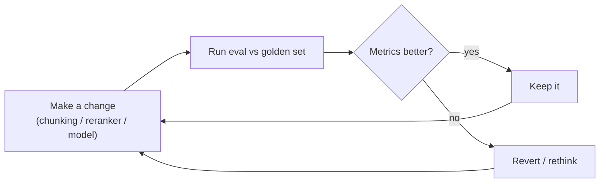

# 14 · Measuring quality (evaluation)

The skill that separates a demo from a product. Anyone can wire up retrieve-then-generate; the hard
part — and the reason customers trust you — is being able to answer **"did that change make it
better or worse?"** with a *number*, not a vibe. This chapter covers the evaluation harness in
`backend/app/services/rag/evaluation/`, why each piece exists, and how to run it.

Terms used here are defined in [the glossary §9](13-rag-glossary.md#9-evaluation--measuring-quality).

## Why you can't skip this

Without eval, every "improvement" is a guess:

- You add a reranker. Did recall go up, or did you just add latency?
- You change the chunk size. Better answers, or did you fragment the tables?
- You upgrade the model. Fewer hallucinations, or the same at 3× the cost?

You **cannot** answer these by reading the code or eyeballing a few queries. You need a **golden set**
you score against, every time. Production RAG teams live in this loop:



## The two things we measure (and why separately)

Retrieval and generation **fail differently**, so we score them independently — otherwise a good
answer hides bad retrieval (or vice-versa) and you can't tell which to fix.

| | Question it answers | How | Metrics |
|---|---|---|---|
| **Retrieval** | Did we fetch the right chunks? | Compare retrieved ids vs the gold ids | recall@k, precision@k, MRR, hit@k, nDCG@k |
| **Generation** | Given context, is the answer good? | LLM-as-judge + substring checks | faithfulness, relevance, precision, completeness |

The diagnostic power is in the split: **low retrieval + high generation** → fix retrieval (chunking,
hybrid weights, reranker). **High retrieval + low faithfulness** → fix generation (prompt, model,
compression). One glance tells you where to spend your time.

## The pieces

### The golden set — `dataset.py`

A JSON file of human-labeled cases. Each case is a `GoldenCase`:

```json
{
  "cases": [
    {
      "id": "apollo-lead",
      "question": "Who led the Apollo internal project?",
      "relevant_document_ids": ["840db863-..."],
      "ground_truth": "The project was led by engineer Maria Chen.",
      "answer_must_contain": ["Maria Chen"]
    }
  ]
}
```

- `relevant_chunk_ids` / `relevant_document_ids` — the **relevance judgments** that drive retrieval
  metrics. Provide whichever granularity your labels are at (chunk-level is stricter).
- `ground_truth` — an ideal answer; enables the **completeness** metric.
- `answer_must_contain` — cheap, *deterministic* substring assertions (no LLM needed).

> This is the artifact you invest in over time. Every time the system gets a query wrong in the wild,
> add it to the golden set — that's how the suite grows teeth.

### The metrics — `metrics.py`

Pure functions, no I/O, unit-tested in CI (`tests/test_eval_metrics.py`, 14 tests). Given a ranked
list of retrieved ids and the set of relevant ids, each returns a score in [0,1]. They're pure on
purpose: the "did my change help?" decision leans on them, so they must be deterministic and
trivially testable. See the glossary for what each means; the docstrings show the math.

### The runner — `runner.py`

`EvaluationRunner` ties it together per case: it calls the **retriever** for retrieval metrics, runs
the **full pipeline** for the answer, and scores the answer with the existing **`RAGEvaluator`** judge
plus the substring checks. It aggregates everything into an `EvalReport` (per-case + means), and a bad
case is caught and recorded rather than aborting the run.

### The CLI — `__main__.py`

```bash
python -m app.services.rag.evaluation <dataset.json> \
    --tenant <TENANT_UUID> --user <USER_UUID> \
    [--top-k 5] [--model gpt-4o-mini] [--no-judge] \
    [--out report.json] [--min-recall 0.6] [--min-faithfulness 0.7]
```

It opens its own tenant-scoped DB session (sets the RLS GUC directly, bypassing HTTP), runs the
dataset, prints a summary, optionally writes the full JSON report, and — with `--min-*` thresholds —
**exits non-zero on regression** so it can gate CI.

## Running it — a worked example

Against a seeded tenant (the "Apollo" test data), with the stack up:

```bash
# unit tests (no DB needed):
docker compose run --rm --no-deps backend python -m pytest tests/test_eval_metrics.py -q

# end-to-end (needs a tenant with ingested docs + an OpenAI key):
#   put the golden file under backend/ so it's bind-mounted into the container at /app
docker compose run --rm backend python -m app.services.rag.evaluation \
    /app/my_golden.json --tenant 0870e686-... --user df847d99-... --out /app/report.json
```

Output:

```
Evaluated 2 case(s) — 0 error(s)
Retrieval  (n=2): hit@5=1.000 recall@5=1.000 precision@5=1.000 mrr=1.000 ndcg@5=1.000
Generation (n=2): faithfulness=1.000 relevance=1.000 precision=1.000 completeness=1.000 overall=1.000
answer_must_contain pass rate: 1.000
```

## Reading the numbers honestly (a crucial lesson)

Those perfect 1.0s look great — and are **almost meaningless**, because that tenant has a **single
document**. Every retrieved chunk *has* to belong to the one relevant doc, so recall/precision are
trivially 1.0. The retriever was never given a chance to be wrong.

**This is the most important habit in evaluation: ask what your metric *can't* tell you.** A metric
that can't go down isn't measuring anything. Real retrieval evaluation needs a **multi-document**
tenant where the right chunks compete with plausible wrong ones.

> ### Exercise — make the eval mean something
> 1. Ingest 10–20 varied documents into one tenant.
> 2. Write 15–20 golden cases with real `relevant_chunk_ids` (open the DB, find the chunks that truly
>    answer each question).
> 3. Run the harness. Now recall@5 will be < 1.0 — a number that can *move*.
> 4. Toggle `--no-reranking`, or flip `use_hyde`, and re-run. Watch which metric changes. *That* is
>    the loop that makes you dangerous.

## Where this goes next

- **Regression gating in CI** — run a small golden set on every PR with `--min-recall` /
  `--min-faithfulness`; fail the build on a drop.
- **Online eval** — log real queries + thumbs-up/down in production to complement the offline set.
- **Bigger judges** — the LLM-as-judge is imperfect; spot-check ~10% by hand, and consider a stronger
  judge model than the one being evaluated.

This closes item ① of the [Competitive Roadmap](../COMPETITIVE_ROADMAP.md). With a measurement loop in
place, every later change — conversation memory, tracing, the custom reranker — becomes something you
can *prove* helped.

---

Prev: [A query, traced end-to-end](14-query-trace.md) · Back to [the index](README.md).
